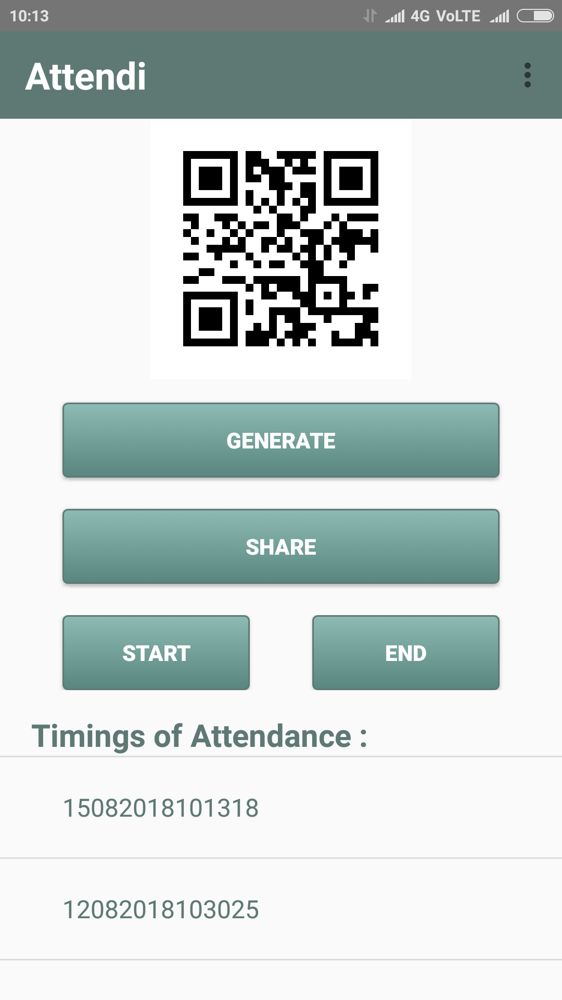
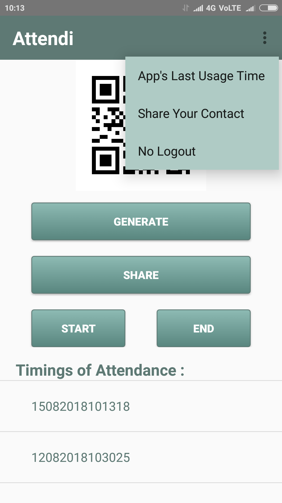
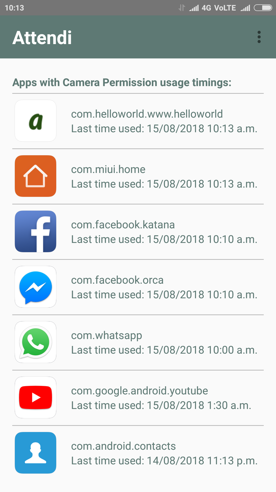
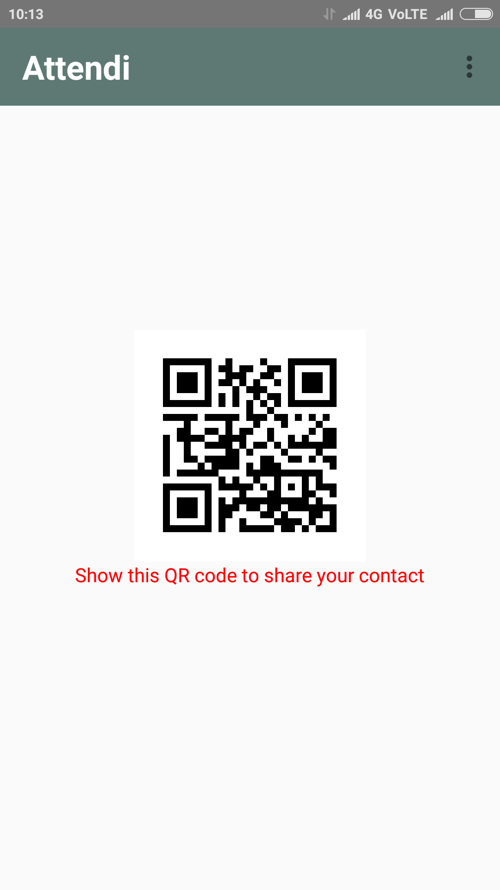

# Attendi

An attendance marking android application. Teacher displays a QR code on the projector in a classroom environment and students scan the QR code in a given time interval. Students who try to open any application which has camera permission enabled are reported to the teacher. In this way, this app restricts user to share the image of the QR code outside the classroom.

#  Some screens of the app

